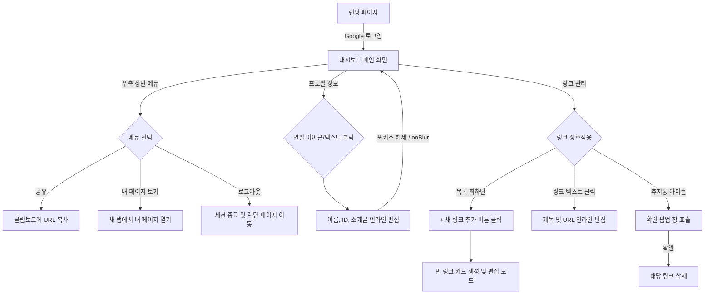

# MyLink 와이어프레임 (UI/UX 설계)

본 문서는 MyLink 프로젝트의 핵심 화면(대시보드) 레이아웃과 사용자 화면 흐름(Flow)을 정의합니다.

---

## 1. 대시보드 메인 화면 레이아웃 (ASCII Art)

모바일 중심의 단일 뷰(Single View)로 설계된 화면입니다. 별도의 설정 창 없이, 메인 화면에서 모든 관리가 가능합니다.

```text
+---------------------------------------------------+
| MyLink               [공유] [내 페이지 보기] [로그아웃] |
|                                                   |
|                ( Profile Image )                  |
|                                                   |
|               [ Username   ✏️ ]                   |
|               [ @displayName ✏️ ]                  |
|               [ 짧은 소개글  ✏️ ]                   |
|                                                   |
| ------------------------------------------------- |
|                                                   |
|   [!] 첫 번째 링크를 추가하여 방문자에게 나를 알려보세요!    |
|       (※ 링크가 0개일 때만 표시되는 가이드 문구)         |
|                                                   |
|   +-------------------------------------------+   |
|   | [파비콘]  링크 제목 ✏️                  [🗑️] |   |
|   |           https://example.com ✏️          |   |
|   +-------------------------------------------+   |
|                                                   |
|   +-------------------------------------------+   |
|   | [파비콘]  포트폴리오 ✏️                 [🗑️] |   |
|   |           https://portfolio.com ✏️        |   |
|   +-------------------------------------------+   |
|                                                   |
|             [ + 새로운 링크 추가 ]                |
|                                                   |
+---------------------------------------------------+
```

---

## 2. UI 컴포넌트별 상세 정의

### 2.1. 상단 메뉴바 (Header)
- **공유 버튼**: 클릭 시 사용자의 고유 퍼블릭 URL(`mylink.com/displayName`)이 클립보드에 즉시 복사됨.
- **내 페이지 보기**: 새 탭(New Tab)으로 퍼블릭 뷰를 열어서 방문자에게 어떻게 보이는지 바로 확인 가능.
- **로그아웃 버튼**: 우측 상단 끝에 위치하여 세션 종료 후 랜딩 페이지로 이동.

### 2.2. 프로필 영역 (Profile Area)
- **수정 가능 인디케이터**: `Username`, `displayName`, `소개글` 옆에 항상 **연필(✏️) 아이콘**을 노출하여 클릭 및 수정 가능함을 직관적으로 알림.
- **인라인 편집**: 텍스트나 연필 아이콘을 클릭하면 즉시 입력창(input)으로 전환되며, 입력 후 바깥 영역을 클릭(onBlur)하면 자동 저장.

### 2.3. 링크 리스트 영역 (Links List Area)
- **빈 화면 가이드 (Empty State)**: 등록된 링크가 없을 때, 친절한 가이드 텍스트를 노출하여 행동(링크 추가)을 유도.
- **링크 카드**: URL을 입력하면 자동으로 파비콘(Favicon)을 추출하여 좌측에 렌더링.
- **링크 수정**: 프로필과 동일하게 제목이나 URL을 클릭하면 그 자리에서 인라인 편집.
- **링크 삭제**: 우측의 휴지통 아이콘 클릭 시, 사용자 실수 방지를 위한 확인(Confirm) 팝업 제공 후 삭제.
- **새 링크 추가 버튼**: 목록이 길어지더라도 일관된 흐름을 위해 링크 리스트의 **가장 아래**에 위치.

---

## 3. 사용자 화면 흐름도 (Mermaid)


